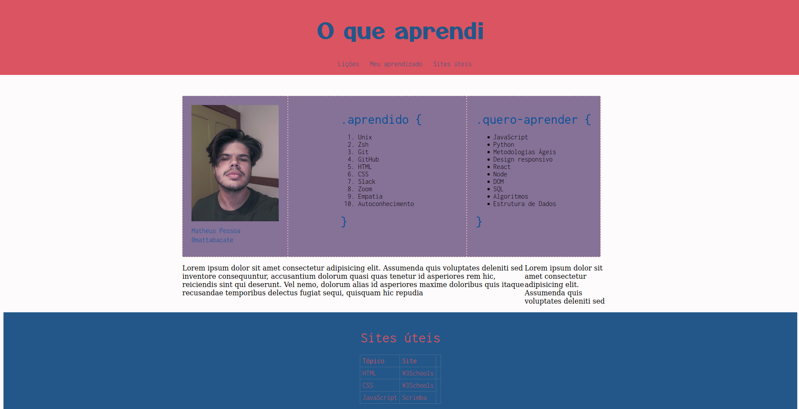

# Projeto #001 - Lessons Learned

Esta é a minha resolução do primeiro projeto do módulo de Fundamentos da Trybe, ao final fui capaz de:

* Utilizar a linguagem de marcação _HTML_ para construir uma página web;
* Utilizar _HTML_ semântico para tornar a página criada mais acessível;
* Utilizar _CSS_ para estilizar a página.

